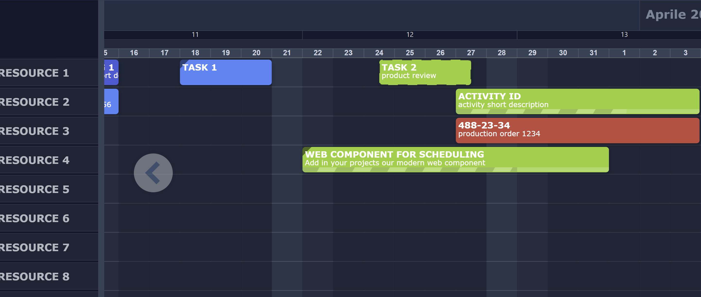
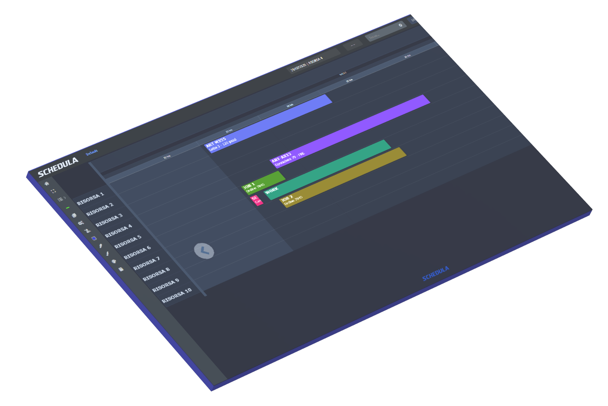

# SchedulaCore

A fast, lightweight Gantt/scheduler component for the web. No framework dependencies — works with vanilla JavaScript or any frontend stack.



[](https://rgabgh.github.io/schedula-core/)

**[▶ Open live demo →](https://rgabgh.github.io/schedula-core/)**

## Features

- **Resource-based Gantt view** — rows are resources, columns are time
- **Multiple item styles** — `rect`, `round-rect`, `arrow`, `circle`
- **Built-in themes** — Default, Dark, Blue, Soft
- **Calendar-aware scheduling** — effort vs duration distinction, non-working days, custom calendars
- **Resource grouping and filtering** — multi-group toggle, text search
- **Task popup** — click any item to view/edit text, description, color, completion %, custom data fields
- **Draggable popup** — reposition the popup anywhere on screen
- **Plugin architecture** — extend via `ISchedulaPlugin`
- **IIFE bundle** — drop a single `<script>` tag, no build step needed

### PRO features (commercial license)



| Feature | Free | PRO |
|---------|------|-----|
| Drag & drop items | | ✓ |
| Resize items | | ✓ |
| Dependency links | | ✓ |
| Calendar exceptions | | ✓ |
| Context menus (customizable) | | ✓ |
| Events / milestones | | ✓ |
| Notification callbacks | ✓ | ✓ |

---

## Quick start

Include the scripts and stylesheet in your page:

```html
<link rel="stylesheet" href="css/schedula-core.css">
<link rel="stylesheet" href="css/scheduler-themes.css">

<div id="scheduler"></div>

<!-- Core FREE bundle -->
<script src="js/schedula-core.min.js"></script>
<!-- Notification plugin (separate, MIT) -->
<script src="js/notification-plugin.min.js"></script>
<!-- Edit this file to intercept events -->
<script src="js/notification-handlers.js"></script>

<script>
    var settings = new SchedulaSettings();
    settings.date = new Date();
    settings.gridStep = 60;  // snap to 1 hour
    settings.plugins = [
        new DefaultPopupPlugin(),
        new NotificationPlugin()
    ];

    var scheduler = new SchedulaCore("scheduler", myData, settings);
    scheduler.init();
    scheduler.refresh();
</script>
```

---

## Data format

```js
var myData = {
    Resources: [
        {
            Id: "r1",
            Name: "Alice",
            Group: 1,
            Items: [
                {
                    Id: "t1",
                    Text: "Design phase",
                    Description: "UI/UX review",
                    Offset: 1440,    // minutes from settings.date
                    Width: 2880,     // duration in minutes
                    Effort: 960,     // working minutes (calendar-aware)
                    Color1: "#2531B1",
                    Completion: 50
                }
            ]
        }
    ]
};
```

> **`Offset`** — start position in minutes from the `settings.date` reference date.
> **`Width`** — total duration in minutes (includes non-working time).
> **`Effort`** — net working minutes. When a calendar is active, SchedulaCore calculates `Width` from `Effort` automatically.

Items can also carry custom data displayed in the popup **Data** tab:

```js
{
    Id: "t1",
    Text: "Task with custom fields",
    data: {
        "Project": "Alpha",
        "Priority": "High"
    }
}
```

---

## API

### Constructor

```js
var scheduler = new SchedulaCore(elementId, data, settings);
```

| Param | Type | Description |
|-------|------|-------------|
| `elementId` | `string` | ID of the container `<div>` |
| `data` | `object` | Resources and tasks |
| `settings` | `SchedulaSettings` | Optional configuration |

### Methods

| Method | Description |
|--------|-------------|
| `scheduler.init()` | Build the component (call once after construction) |
| `scheduler.refresh()` | Redraw (call after data changes) |
| `scheduler.setData(data)` | Replace all data and redraw |
| `scheduler.setView(n)` | Set visible time units (e.g. `30` = 30-day window) |
| `scheduler.setStyle(style)` | Item shape: `"rect"`, `"round-rect"`, `"arrow"`, `"circle"` |
| `scheduler.filterItems(text)` | Filter items by text (empty string = clear filter) |

---

## Settings

```js
var settings = new SchedulaSettings();

settings.date           = new Date();        // reference start date
settings.canMoveItems   = true;              // allow item movement (PRO: DragDropPlugin)
settings.canResizeItems = false;             // allow item resize (PRO: DragDropPlugin)
settings.drawLinks      = false;             // show dependency links (PRO: LinksPlugin)
settings.gridStep       = 60;               // snap grid in minutes (60 = 1 hour)
settings.gStyle         = 'round-rect';     // item shape
settings.resourceHeight = 48;               // row height in px
settings.resourceWidth  = 200;              // sidebar width in px
settings.hilightSunday  = true;             // highlight Sundays
settings.animation      = true;             // CSS transitions

settings.plugins        = [new DefaultPopupPlugin(), new NotificationPlugin()];
settings.licenseKey     = 'YOUR-PRO-KEY';  // PRO only
```

---

## Plugins

Plugins implement `ISchedulaPlugin` and are registered via `settings.plugins`.

```ts
interface ISchedulaPlugin {
    readonly name: string;
    init(core: ISchedulaCore): void;
    destroy(): void;
}
```

**Free:**
- `DefaultPopupPlugin` — tabbed popup with General and Data tabs, draggable, color picker
- `NotificationPlugin` — event callbacks via `window.SchedulaHandlers` (see below)

**PRO (commercial license required):**
- `DragDropPlugin` — drag items across resources and time
- `CalendarPlugin` — working day rules, per-resource calendars, exceptions
- `LinksPlugin` — dependency arrows between tasks
- `EventsPlugin` — milestones and events on the timeline
- `ContextMenuPlugin` — right-click menus (customizable via `ContextMenuConfig`)

---

## NotificationPlugin

`NotificationPlugin` is available in both Free and PRO. It lets you intercept scheduler events without modifying the plugin itself — just edit `js/notification-handlers.js`:

```js
// notification-handlers.js
window.SchedulaHandlers = {

    // Return false to cancel the action (veto)
    onBeforeItemChange(item, oldState) { return true; },
    onBeforeItemAdd(item)              { return true; },
    onBeforeItemDelete(item)           { return true; },

    // Post-action hooks
    onItemChanged(item, element) {
        console.log('changed', item.Id);
        // fetch('/api/tasks', { method: 'PUT', body: JSON.stringify(item) });
    },
    onItemAdded(item)                          { console.log('added', item); },
    onItemDeleted(item)                        { console.log('deleted', item.Id); },
    onItemSaved(item)                          { console.log('saved', item); },
    onMenuAction(actionId, item, ctx, element) { console.log(actionId, ctx); },
    onCalendarChanged(rule, action)            { console.log(action, rule); },
};
```

Callbacks are resolved in order: `window.SchedulaHandlers` → instance method (backward-compat). If a function is missing or throws, the plugin continues silently.

---

## Themes

Add a class to the scheduler container (or `document.body`) to switch theme:

```js
document.getElementById('scheduler').classList.add('theme-dark');
// or: 'theme-blue', 'theme-soft'
```

---

## Browser support

ES2015+ (Chrome, Firefox, Edge, Safari). IE not supported.

---

## Used in production

SchedulaCore powers real-world scheduling applications across different industries:

| Product | Industry | Notes |
|---------|----------|-------|
| **[OVERCORE](https://www.overcore.it/)** | Hotel & hospitality | Booking and room scheduling software |
| **[MECCANICA H7](https://www.meccanicah7.it/)** | Manufacturing | Production scheduling for mechanical workshops |
| **[SCHEDULA Planner](https://www.schedulaplanner.com/)** | Manufacturing / ERP | Production planning with ERP integration |

---

## Contact & PRO license

For PRO license inquiries, custom integrations, or support:

📧 **[gabriraf@gmail.com](mailto:gabriraf@gmail.com)**

---

## PRO License

SchedulaCore PRO is distributed under a commercial per-project license:

- **Single Application** — use in one application, unlimited deployments
- **OEM** — use in a product commercially distributed to third parties

License keys are issued per project. Redistribution of the PRO bundle as a standalone component is not permitted.

📧 **[gabriraf@gmail.com](mailto:gabriraf@gmail.com)**

---

## License

MIT — see [LICENSE](LICENSE).
PRO plugins are distributed under a separate commercial license.
