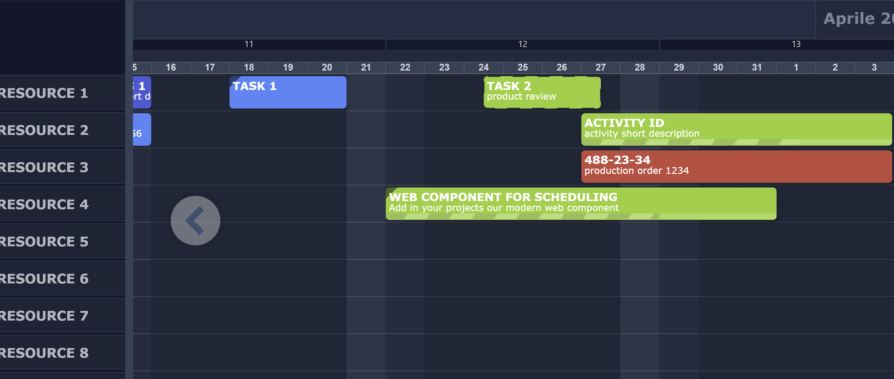

# SchedulaCore

A fast, lightweight Gantt/scheduler component for the web. No framework dependencies — works with vanilla JavaScript or any frontend stack. And when you do use a framework, there's an **official wrapper for React, Vue 3 and Angular**, so you can drop it in as a native component (`<SchedulaGantt … />`) with declarative props, typed APIs and reactive updates — no manual DOM wiring.



[](https://rgabgh.github.io/schedula-core/)

[](https://www.npmjs.com/package/schedula-core)
[](https://www.npmjs.com/package/schedula-core-react)
[](https://www.npmjs.com/package/schedula-core-vue)
[](https://www.npmjs.com/package/schedula-core-angular)

**[Open live demo](https://rgabgh.github.io/schedula-core/)**

## Features

- **Resource-based Gantt view** — rows are resources, columns are time
- **Multiple item styles** — `rect`, `round-rect`, `arrow`, `circle`
- **Built-in themes** — Default, Dark, Blue, Soft (switchable at runtime)
- **Task popup** — click any item to view/edit (built-in, no configuration needed)
- **Resource grouping and filtering** — multi-group toggle, text search
- **Smooth animations** — animated shifts, transitions and progress bars
- **Event notifications** — intercept every action via `window.SchedulaHandlers`
- **Plugin architecture** — extend via `ISchedulaPlugin`
- **IIFE bundle** — drop a single `<script>` tag, no build step needed
- **Official React / Vue / Angular wrappers** — native component, declarative props, reactive updates (`schedula-core-react`, `schedula-core-vue`, `schedula-core-angular`)

### Free vs PRO

| Feature | Free | PRO |
|---------|------|-----|
| JSON data, themes, animations, popup | ✓ | ✓ |
| Switchable views (zoom) | ✓ | ✓ |
| Event notifications | ✓ | ✓ |
| Customizable settings | ✓ | ✓ |
| Drag & drop items | | ✓ |
| Resize items | | ✓ |
| Edit mode toggle (runtime) | | ✓ |
| Dependency links | | ✓ |
| Calendar exceptions & holidays | | ✓ |
| Context menus (customizable) | | ✓ |
| Events / milestones | | ✓ |
| Resource & item icons | | ✓ |
| Custom popup provider | | ✓ |
| Incremental update API | | ✓ |

---

## Install

**With npm** (bundler — Vite, webpack, esbuild, …):

```bash
npm install schedula-core
```

```js
import { SchedulaCore, SchedulaSettings } from 'schedula-core';
import 'schedula-core/css';        // core styles
import 'schedula-core/css/popup';  // task popup
// optional themes: import 'schedula-core/css/themes';
```

Bundled TypeScript types are included — no `@types` package needed.

**React / Vue / Angular** — use the official wrappers (declarative, typed components):

| Framework | Package |
|---|---|
| React 17+ | `npm i schedula-core schedula-core-react` |
| Vue 3 | `npm i schedula-core schedula-core-vue` |
| Angular 16+ | `npm i schedula-core schedula-core-angular` |

See **[INTEGRATION.md](INTEGRATION.md)** for full examples, plus Next.js, Nuxt, Svelte and Blazor.

**Or via a `<script>` tag** (no build step, no npm):

```html
<link rel="stylesheet" href="https://unpkg.com/schedula-core/css/schedula-core.css">
<script src="https://unpkg.com/schedula-core"></script>
```

Want to see it first? A standalone, offline demo is bundled in the package — open **`package-demo.html`** in a browser (no server needed).

---

## Quick start

```html
<link rel="stylesheet" href="css/schedula-core.css">
<div id="scheduler"></div>
<script src="js/schedula-core.min.js"></script>

<script>
    var data = {
        Resources: [
            { Id: "1", Name: "Alice", Items: [
                { Id: "t1", Text: "Design phase", Offset: 0, Width: 2880, Color1: "#2043D9" },
                { Id: "t2", Text: "Development",  Offset: 2880, Width: 4320, Color1: "#006BF7" }
            ]},
            { Id: "2", Name: "Bob", Items: [
                { Id: "t3", Text: "Testing", Offset: 1440, Width: 1440, Color1: "#00AAB5" }
            ]}
        ]
    };

    var settings = new SchedulaSettings();
    settings.date = new Date();

    var scheduler = new SchedulaCore("scheduler", data, settings);
    scheduler.init();
</script>
```

`settings.date` is the reference date for the timeline. Each item's **`Offset`** is the start position in minutes from that date, and **`Width`** is the duration in minutes. The component handles all the rendering — click any item to open the built-in popup.

---

## Data format

### Resources and Items

```js
{
    Resources: [
        {
            Id: "r1",              // unique resource identifier
            Name: "Alice",         // display name
            Group: 1,              // optional: for group filtering
            Items: [ ... ]         // array of scheduled tasks
        }
    ]
}
```

### Item fields

| Field | Type | Required | Description |
|-------|------|----------|-------------|
| `Id` | string | yes | Unique identifier |
| `Text` | string | yes | Display title |
| `Offset` | number | yes | Start position (minutes from `settings.date`) |
| `Width` | number | yes | Duration in minutes |
| `Color1` | string | | Hex color (e.g. `"#2043D9"`) |
| `Description` | string | | Second line of text |
| `Completion` | number | | Progress percentage (0-100) |
| `Effort` | number | | Net working minutes (calendar-aware, PRO) |
| `Classes` | string | | CSS classes (space-separated) |
| `Link` | string | | Dependency link to another item's Id (PRO) |
| `Type` | string | | Shape override: `"Arrow"`, `"Circle"`, `"Gantt"` |

> **How positioning works:** `settings.date` is the origin of the timeline (typically today or the start of the planning period). An item with `Offset: 1440` starts 1 day after `settings.date` (1440 minutes = 24 hours). An item with `Width: 2880` lasts 2 days.

---

## API

```js
var scheduler = new SchedulaCore(elementId, data, settings);
scheduler.init();
```

| Method | Description |
|--------|-------------|
| `init()` | Build the component (call once) |
| `refresh()` | Redraw after external data changes |
| `setData(data)` | Replace all data and redraw |
| `setView(n)` | Set visible time units (e.g. `30` = 30-day window) |
| `setStyle(style)` | Item shape: `"rect"`, `"round-rect"`, `"arrow"`, `"circle"` |
| `filterItems(text)` | Filter items by text (empty = clear filter) |

---

## Settings

```js
var settings = new SchedulaSettings();

// Timeline
settings.date           = new Date();    // reference start date
settings.timeUnitsView  = 30;           // visible days
settings.timeUnitVal    = 1440;         // minutes per time unit (1440 = 1 day)
settings.gridStep       = 1440;         // snap grid in minutes

// Appearance
settings.gStyle         = 'round-rect'; // item shape
settings.resourceHeight = 48;           // row height in px
settings.resourceWidth  = 200;          // sidebar width in px
settings.hilightSunday  = true;         // highlight Sundays
settings.animation      = true;         // CSS transitions
settings.locale         = 'en-US';      // date format locale
```

---

## NotificationPlugin

Intercept scheduler events without modifying the component — edit `notification-handlers.js`:

```js
window.SchedulaHandlers = {
    // Return false to cancel the action (veto)
    onBeforeItemChange(item, oldState) { return true; },
    onBeforeItemAdd(item)              { return true; },
    onBeforeItemDelete(item)           { return true; },

    // Post-action hooks
    onItemChanged(item, element) { console.log('changed', item.Id); },
    onItemAdded(item)            { console.log('added', item); },
    onItemDeleted(item)          { console.log('deleted', item.Id); },
    onItemSaved(item)            { console.log('saved', item); },
    onItemResizing(item, widthMinutes, element) { /* PRO: live resize feedback */ },
    onCalendarChanged(rule, action) { console.log(action, rule); },
};
```

Load the plugin before the core bundle:
```html
<script src="js/notification-handlers.js"></script>
<script src="js/schedula-core.min.js"></script>
```

---

## Themes

```js
settings.theme = 'theme-dark';
// or: 'theme-blue', 'theme-soft', '' (default)
```

---

## Browser support

ES2015+ (Chrome, Firefox, Edge, Safari). IE not supported.

---

## Used in production

| Product | Industry | Notes |
|---------|----------|-------|
| **[OVERCORE](https://www.overcore.it/)** | Hotel & hospitality | Booking and room scheduling software |
| **[MECCANICA H7](https://www.meccanicah7.it/)** | Manufacturing | Production scheduling for mechanical workshops |
| **[SCHEDULA Planner](https://www.schedulaplanner.com/)** | Manufacturing / ERP | Production planning with ERP integration |

---

## PRO license

SchedulaCore PRO adds drag & drop, resize, runtime edit mode, dependency links, calendar exceptions & holidays, context menus, resource/item icons, custom popups and the incremental update API.

Licensing is **per project, not per developer** — one license covers your whole team. All licenses are perpetual (one-time payment) and include 1 year of updates and support. Every license lets you build your application and ship it to unlimited end users.

| License | Price | What it covers |
|---------|-------|----------------|
| **Single Project** | **€499** | Use in one application. Ship it to unlimited end users — internal or commercial. |
| **Unlimited Projects** | **€1,990** | Use in any number of applications within your company. Unlimited end users. |
| **+ Source Code** | **€2,900** | Unlimited Projects, plus the full TypeScript source code for customization and self-maintenance. |
| **OEM / Redistribution** | **Contact us** | Required only if SchedulaCore PRO is redistributed as a component, or embedded in a product or SaaS that is resold or sublicensed to third parties. |

> For comparison, comparable commercial Gantt components are priced at **$700–900 per developer**. SchedulaCore PRO is licensed per project, so one license covers your entire team.

To purchase or request a quote: **[gabriraf@gmail.com](mailto:gabriraf@gmail.com)**

---

## License

MIT — see [LICENSE](LICENSE).
PRO plugins are distributed under a separate commercial license.
